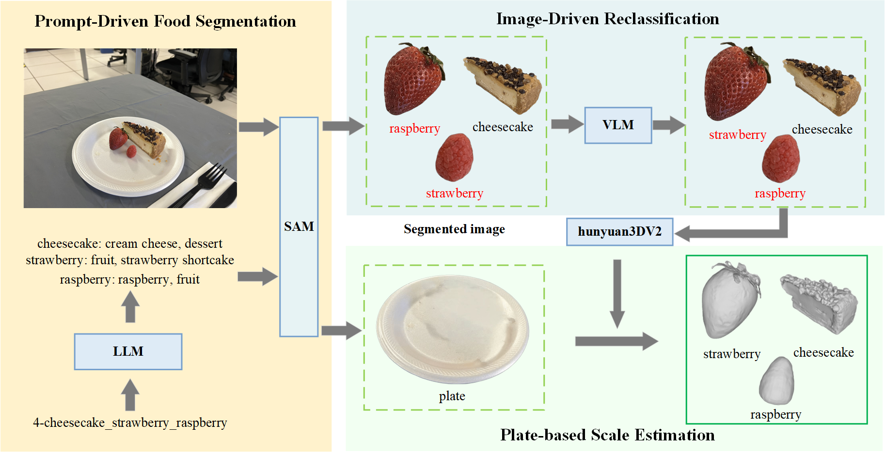
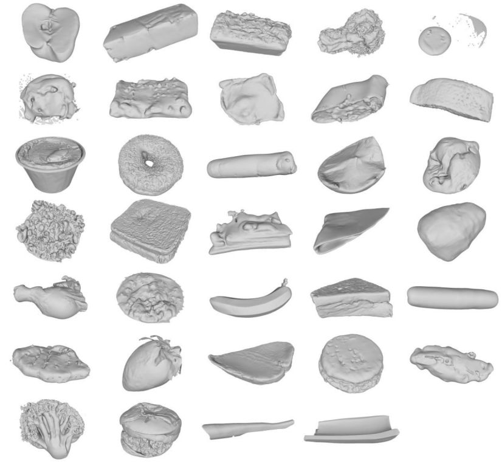
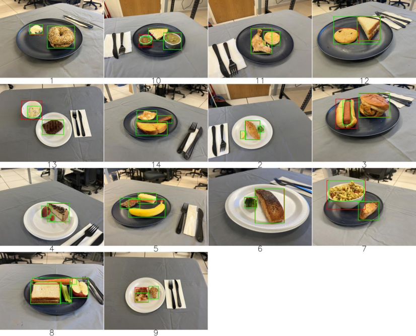

## Repository Overview

This repository houses the code implementation for the technical report of the **3D Reconstruction From Monocular Multi-Food Images Challenge** at the CVPR 2025 MetaFood Workshop.


## Get Started

### SAM Installation
```bash
pip install -r ./SAM/requirements.txt
```

### Hunyuan3Dv2 Installation
```bash
pip install -r ./Hunyuan3D-2/requirements.txt
```


## Usage

### Data Preparation
```
.
└── food_mask
    ├── 1-bagel_cream_cheese
    ├── 2-breaded_fish_lemon_broccoli
    ├── 3-burger_hot_dog
    ├── 4-cheesecake_strawberry_raspberry
    ├── 5-energy_bar_cheddar_cheese_banana
    ├── 6-grilled_salmon_broccoli
    ├── 7-pasta_garlic_bread
    ├── 8-pbj_carrot_stick_apple_celery
    ├── 9-pizza_chicken_wing
    ├── 10-quesadilla_guacamole_salsa
    ├── 11-roast_chicken_leg_biscuit
    ├── 12-sandwich_cookie
    ├── 13-steak_mashed_potatoes
    └── 14-toast_sausage_fried_egg
```

### Plate (Reference Object) Segmentation
```bash
python ./SAM/plate_sam.py
```

### Food Segmentation (Per Food Item)
Modify the `api_key` in `food_sam.py` before running:
```bash
python ./SAM/food_sam.py
```

Output Data Format After Execution:
```
.
└── food_mask
    ├── 1-bagel_cream_cheese
    │   ├── 1.jpeg
    │   ├── 1_boxes_filt.txt    # Bounding box for the plate
    │   ├── bagel.jpg
    │   ├── bagel.txt           # Bounding box for bagel
    │   ├── bagel_cropped.jpg   # Segmented bagel image
    │   ├── cream_cheese.jpg
    │   ├── cream_cheese.txt    # Bounding box for cream cheese
    │   ├── cream_cheese_cropped.jpg  # Segmented cream cheese image
    │   └── plate.jpg
    ├── 2-breaded_fish_lemon_broccoli
    ├── 3-burger_hot_dog
    ├── 4-cheesecake_strawberry_raspberry
    ├── 5-energy_bar_cheddar_cheese_banana
    ├── 6-grilled_salmon_broccoli
    ├── 7-pasta_garlic_bread
    ├── 8-pbj_carrot_stick_apple_celery
    ├── 9-pizza_chicken_wing
    ├── 10-quesadilla_guacamole_salsa
    ├── 11-roast_chicken_leg_biscuit
    ├── 12-sandwich_cookie
    ├── 13-steak_mashed_potatoes
    └── 14-toast_sausage_fried_egg
```

### 3D Reconstruction
```bash
python mask_big.py
python ./Hunyuan3D-2/food.py
```

### Scale Estimation
```bash
python scale_estimation.py
```
- Adjust `real_plate` for the actual width of the reference plate (e.g., a physical plate’s width).
- Tune the perspective scaling factor `r` as needed.


### Volume and Chamfer Distance Metrics




| Object Index | Predicted volume | Ground truth | Error percentage | Chamfer distance |
|--------------|------------------|--------------|------------------|------------------|
| 1            | 293.65           | 280.71       | 12.94            | 5.796618         |
| 2            | 8.13             | 30.26        | 22.13            | 10.137541        |
| 3            | 77.48            | 93.25        | 15.77            | 6.59741          |
| 4            | 15.86            | 8.84         | 7.02             | 9.079356         |
| 5            | 12.76            | 14.35        | 1.59             | 2.981458         |
| 6            | 363.56           | 435.24       | 71.68            | 10.368625        |
| 7            | 13.93            | 222.66       | 208.73           | 29.412099        |
| 8            | 96.07            | 94.3         | 1.77             | 8.543460         |
| 9            | 24.98            | 36.17        | 11.19            | 4.372186         |
| 10           | 5.63             | 5.47         | 0.16             | 1.160205         |
| 11           | 26.02            | 57.73        | 31.71            | 9.177924         |
| 12           | 35.21            | 86.94        | 51.73            | 12.646923        |
| 13           | 92.01            | 141.67       | 49.66            | 9.913942         |
| 14           | 88.38            | 130.67       | 42.29            | 13.828343        |
| 15           | 203.42           | 828.23       | 624.81           | 29.171016        |
| 16           | 52.72            | 81.48        | 28.76            | 7.391703         |
| 17           | 204.89           | 262.9        | 58.01            | 5.810387         |
| 18           | 4.15             | 85.28        | 81.13            | 15.484578        |
| 19           | 197.11           | 131.56       | 65.55            | 8.866644         |
| 20           | 12.2             | 14.6         | 2.4              | 12.712560        |
| 21           | 17.95            | 89.3         | 71.35            | 21.676434        |
| 22           | 58.21            | 47.99        | 10.22            | 3.871832         |
| 23           | 25.71            | 77.15        | 51.44            | 13.725036        |
| 24           | 211.74           | 122.93       | 88.81            | 9.740972         |
| 25           | 4.7              | 45.54        | 40.84            | 10.343567        |
| 26           | 140.16           | 134.41       | 5.75             | 13.049587        |
| 27           | 93.39            | 106.57       | 13.18            | 2.600901         |
| 28           | 84.1             | 198.43       | 114.33           | 15.395517        |
| 29           | 27.18            | 53.58        | 26.4             | 24.625002        |
| 30           | 171.43           | 147.74       | 23.69            | 5.350468         |
| 31           | 157.43           | 246.48       | 89.05            | 17.255887        |
| 32           | 87.41            | 117.1        | 29.69            | 6.394715         |
| 33           | 8.79             | 18.18        | 9.39             | 7.279437         |
| 34           | 14.58            | 38.88        | 24.3             | 9.452481         |


### Segmentation Metric Calculation
We evaluate food segmentation performance (beyond competition metrics like volume and Chamfer Distance) using manually annotated bounding boxes as ground truth (GT). GT data structure:
```
.
└── food_mask_GT
    ├── 1-bagel_cream_cheese
    ├── 2-breaded_fish_lemon_broccoli
    ├── 3-burger_hot_dog
    ├── 4-cheesecake_strawberry_raspberry
    ├── 5-energy_bar_cheddar_cheese_banana
    ├── 6-grilled_salmon_broccoli
    ├── 7-pasta_garlic_bread
    ├── 8-pbj_carrot_stick_apple_celery
    ├── 9-pizza_chicken_wing
    ├── 10-quesadilla_guacamole_salsa
    ├── 11-roast_chicken_leg_biscuit
    ├── 12-sandwich_cookie
    ├── 13-steak_mashed_potatoes
    └── 14-toast_sausage_fried_egg
```

Calculate IOU for segmentation:
```bash
python IOU.py
```

### Segmentation IOU Results



| Object Index | Food Item              | IOU    |
|--------------|-----------------------|--------|
| 1            | bagel                 | 0.986  |
| 2            | cream_cheese          | 0.926  |
| 3            | breaded_fish          | 0.943  |
| 4            | lemon                 | 0.945  |
| 5            | broccoli              | 0.973  |
| 6            | burger                | 0.968  |
| 7            | hot_dog               | 0.330  |
| 8            | cheesecake            | 0.970  |
| 9            | strawberry            | 0.970  |
| 10           | raspberry             | 0.970  |
| 11           | energy_bar            | 0.980  |
| 12           | cheddar_cheese        | 0.955  |
| 13           | banana                | 0.903  |
| 14           | grilled_salmon        | 0.975  |
| 15           | pasta                 | 0.646  |
| 16           | garlic_bread          | 0.989  |
| 17           | pb&j                  | 0.958  |
| 18           | carrot_stick          | 0.818  |
| 19           | apple                 | 0.967  |
| 20           | celery                | 0.945  |
| 21           | pizza                 | 0.589  |
| 22           | chicken_wing          | 0.978  |
| 23           | quesadilla            | 0.954  |
| 24           | guacamole             | 0.979  |
| 25           | salsa                 | 0.473  |
| 26           | roast_chicken_leg     | 0.970  |
| 27           | biscuit               | 0.948  |
| 28           | sandwich              | 0.949  |
| 29           | cookie                | 0.298  |
| 30           | steak                 | 0.969  |
| 31           | mashed_potatoes       | 0.395  |
| 32           | toast                 | 0.967  |
| 33           | sausage               | 0.922  |
| 34           | fried_egg             | 0.969  |


## 🤗Acknowledgement

This work is built on many amazing research works and open-source projects, thanks a lot to all the authors for sharing!

- [Grounded-Segment-Anything](https://github.com/IDEA-Research/Grounded-Segment-Anything)
- [Hunyuan3D-2](https://github.com/Tencent-Hunyuan/Hunyuan3D-2)
- [Qwen-VL](https://github.com/QwenLM/Qwen-VL)